# Lab 1: HTTP file server with TCP sockets

**Student Name:** Mihalevschi Alexandra  
**Date:** [Date]  
**Course:** Network Programming

---

## 1. Source Directory Contents

### Project Structure

```
Lab1/
├── docker-compose.yml
├── Dockerfile
├── server.py
├── client.py
└── content/
    ├── index.html
    ├── image1.png
    ├── image2.png
    ├── shrek-script.pdf
    ├── shrek-book1.pdf
    └── subfolder/
        ├── shrek_book.pdf
        └── another-image.png
```

**Screenshot:** Directory listing

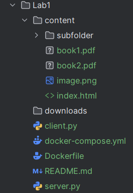

### File Descriptions

- **server.py**: Main HTTP server implementation
- **client.py**: HTTP client for downloading files
- **docker-compose.yml**: Docker service configuration
- **Dockerfile**: Docker image definition
- **content/**: Directory containing files to be served

---

## 2. Docker Configuration

### docker-compose.yml

**Code-snippet:** docker-compose.yml contents

```yaml
services:
  server:
    build: .
    container_name: http-file-server
    ports:
      - "8080:8080"
    volumes:
      - ./content:/app/content
    command: python server.py /app/content
    networks:
      - pdf-network
    restart: unless-stopped

networks:
  pdf-network:
    driver: bridge
```

**Explanation:**
- `ports`: Maps container port 8080 to host port 8080
- `volumes`: Shares local content folder with container
- `command`: Runs server with /app/content as directory argument

### Dockerfile

**Code-snippet:** Dockerfile contents


```dockerfile
FROM python:3.11-slim
WORKDIR /app
COPY server.py /app/
COPY client.py /app/
RUN chmod +x server.py client.py
RUN mkdir -p /app/content
EXPOSE 8080
CMD ["python", "server.py", "/app/content"]
```

**Explanation:**
- Uses Python 3.11 as base image
- Sets working directory to /app
- Copies server and client scripts
- Exposes port 8080

---

## 3. Starting the Container

### Build and Start

**Command:**
```bash
cd Lab1
docker-compose up --build
```

**Screenshot:** Container starting

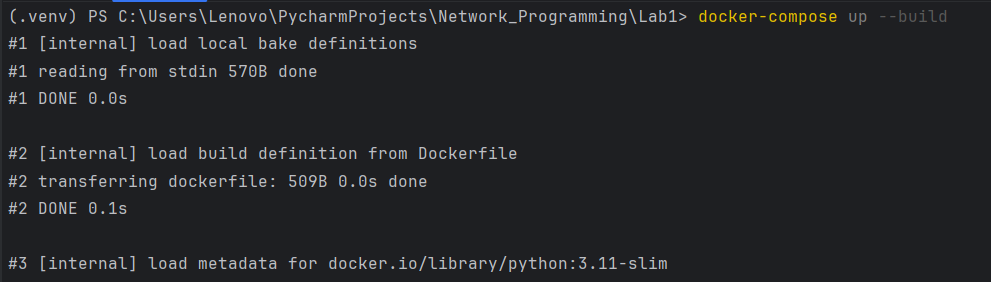

**Screenshot:** Run and stop 

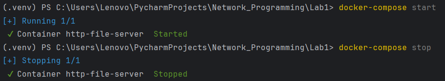

**Output shows:**
- Building Docker image
- Creating container
- Server starting message: "Server started on http://0.0.0.0:8080"
- "Serving files from: /app/content"


## 4. Server Command with Directory Argument

### Command Inside Container

The server runs with the following command:
```bash
python server.py /app/content
```

**Code-snippet:** CMD command, in Dockerfile

```Dockerfile
CMD ["python", "server.py", "/app/content"]```

### Code Implementation

The server accepts the directory as a command-line argument:

```python
def main():
    if len(sys.argv) != 2:
        print("Usage: python server.py <directory>")
        sys.exit(1)
    
    directory = sys.argv[1]  # /app/content
    
    if not os.path.isdir(directory):
        print(f"Error: Directory '{directory}' does not exist!")
        sys.exit(1)
    
    # Server uses this directory to serve files
```

---

## 5. Contents of Served Directory

### Files in content/

**Screenshot:** Content directory listing

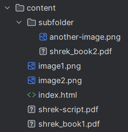

**Files:**
- `index.html` - Homepage with embedded image
- `image.png` - Sample image
- `shrek-script.pdf` - Sample PDF document
- `shrek_book1.pdf` - Sample PDF document
- `subfolder/` - Subdirectory with additional files
  - `shrek_book2.pdf` 
  - `another-image.png` 

---

## 6. Browser Requests - Four File Types

### 6.1 Request 1: 404 - File Not Found

**Screenshot:** Browser showing 404 error

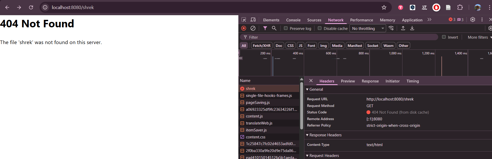

---

### 6.2 Request 2: HTML File with Embedded Image

**Screenshot:** Browser showing HTML page with image

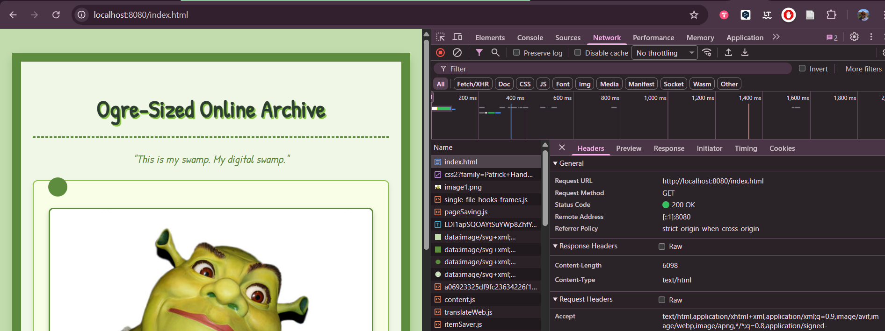


Browser makes TWO requests:
1. GET /index.html (HTML file)
2. GET /image.png (embedded image)

---

### 6.3 Request 3: PDF File

**Screenshot:** Browser displaying PDF

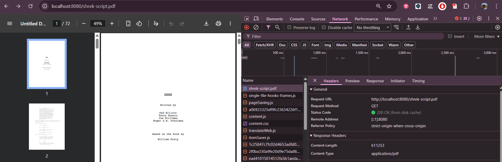


**Headers:**
- Status: 200 OK
- Content-Type: application/pdf
- Content-Length: 245760 bytes

---

### 6.4 Request 4: PNG Image

**Screenshot:** Browser displaying PNG image

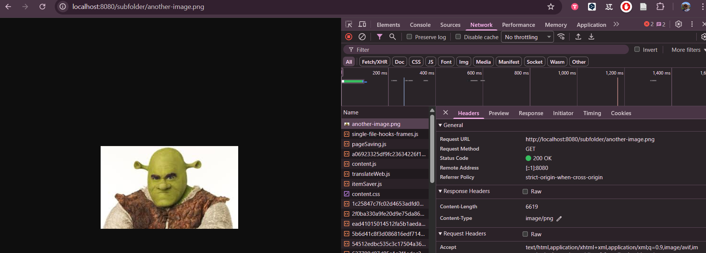

**Headers:**
- Status: 200 OK
- Content-Type: image/png

---

## 7. HTTP Client Implementation and Testing


**Command example:**
```bash
python client.py localhost 8080 /book1.pdf ./downloads
```

**Screenshot:** Client interaction

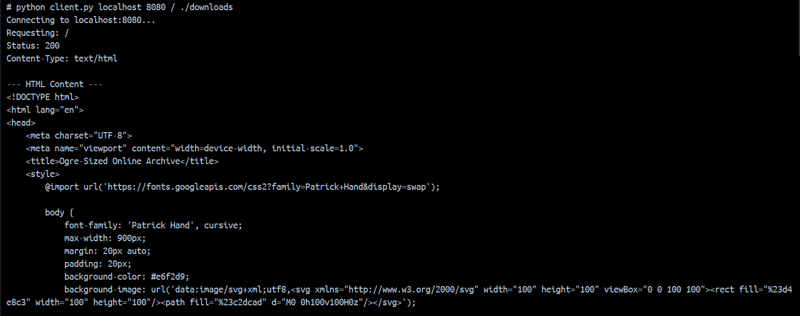
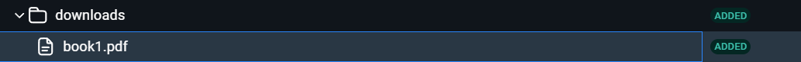

## 8. Directory Listing Feature


**URL:** `http://localhost:8080/subfolder/`

**Screenshot:** Generated directory listing page

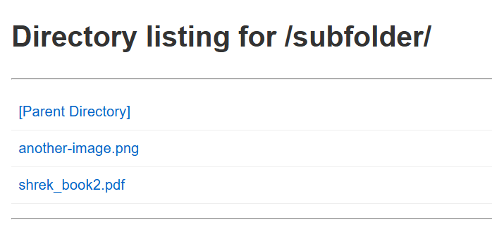

**Features:**
- Title showing current path
- Link to parent directory
- List of files with clickable links
- Folders marked with trailing slash


**Command:**
```bash
python client.py localhost 8080 /subfolder/ ./downloads
```


---

## 9. Network Testing - Friend's Server

### 9.1 Setup

Since the lab is done with no friends around, I decided to "simulate" the friend. Thus, i created a dummy project, on 8081 port, and used it to test what is needed.

**Created two server instances:**
- My Server: `localhost:8080` (Lab1 folder)
- Friend's Server: `localhost:8081` (Friend-Server folder)


**Modified docker-compose.yml for Friend's server:**
```yaml
ports:
  - "8081:8080"  
```

---

### 9.2 Running Both Servers

**Screenshot:** Terminal 1 - My server

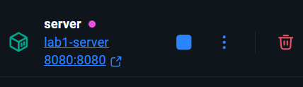

**Screenshot:** Terminal 2 - Friend's server

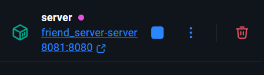


```
CONTAINER ID   IMAGE                  COMMAND                  CREATED         STATUS         PORTS                                         NAMES
4436da805ea4   friend_server-server   "python server.py /a…"   4 minutes ago   Up 4 minutes   0.0.0.0:8081->8080/tcp, [::]:8081->8080/tcp   friend-server
d0cbd8a759bd   lab1-server            "python server.py /a…"   7 minutes ago   Up 7 minutes   0.0.0.0:8080->8080/tcp, [::]:8080->8080/tcp   http-file-server
```

---

### 9.3 Network Information

Now, we need to get the ip of the friend. In this case, I will call my own IP, since I am to part of the LAN.

**Command:**
```bash
ipconfig     
```

Then test the existance of the project on local net.

**Screenshot:** Curl with IP

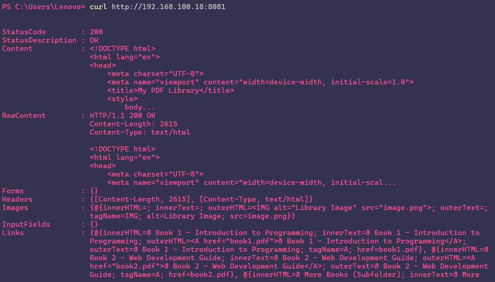


**Network Setup:**
```
My Computer (192.168.1.XXX)
├── Container 1: My Server (localhost:8080)
└── Container 2: Friend's Server (localhost:8081)
```

---

### 9.4 Browsing Friend's Server in Browser

**URL:** `http://localhost:8081`

**Screenshot:** Friend's homepage

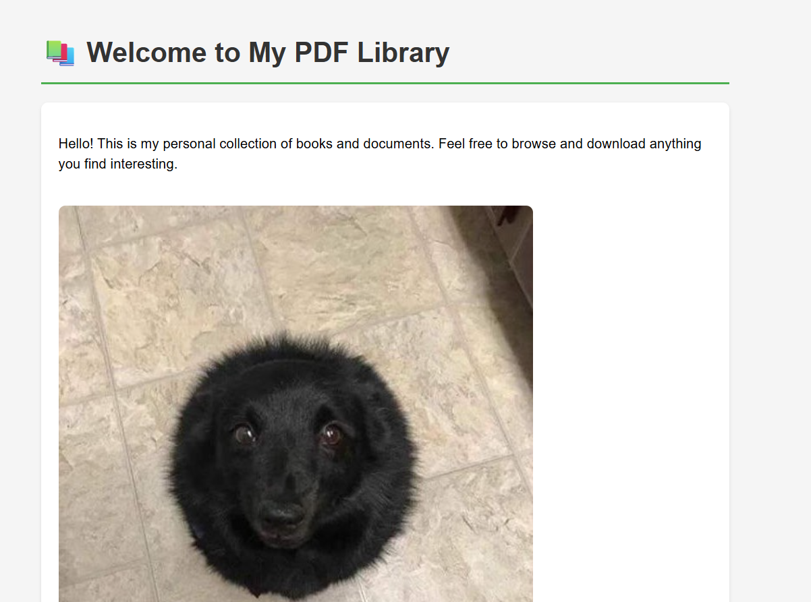


---

### 9.5 Using Client to Download from Friend's Server

**Command:**
```bash
python client.py localhost 8081 /friend-book1.pdf ./downloads
```

**Screenshot:** Client downloading from friend

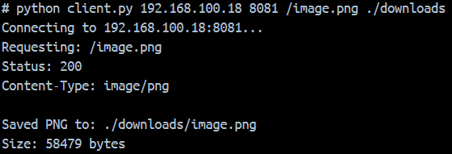

**Screenshot:** Friend's file in downloads folder


### Supported MIME Types

| Extension | MIME Type          |
|-----------|-------------------|
| .html     | text/html         |
| .pdf      | application/pdf   |
| .png      | image/png         |

---
