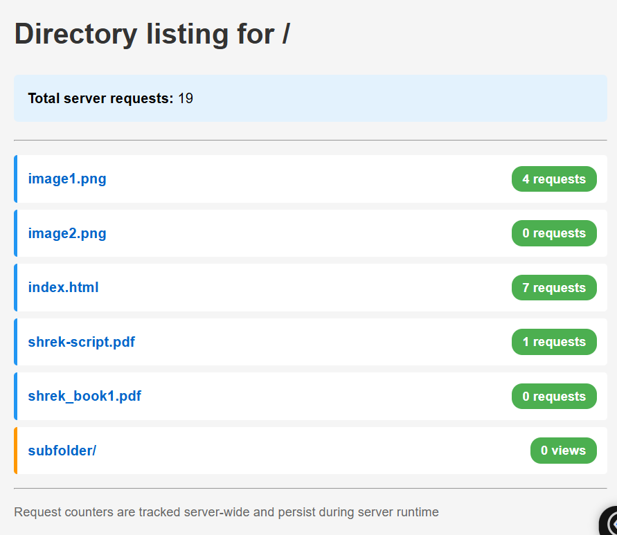

# Lab 2: Concurrent HTTP server

**Student Name:** Mihalevschi Alexandra  
**Date:** 21.10.2025 \
**Course:** Network Programming

---

## 1. Source Directory Contents

### Project Structure

```
Lab2/
├── docker-compose.yml
├── Dockerfile
├── server.py
├── test_requests.py
├── client.py
└── content/
```

**Screenshot:** Directory listing


### File Descriptions

- **server.py**: HTTP server with threads, concurrency, rate limiting implementation
- **docker-compose.yml**: Docker service configuration
- **Dockerfile**: Docker image definition
- **content/**: Directory containing files to be served
- **client.py**: Not so relevant for the lab

---

## 2. Docker Configuration

### docker-compose.yml

```yaml
services:
  # Multithreaded HTTP File Server
  server:
    build: .
    container_name: http-server-multithreaded
    ports:
      - "8081:8080"
    volumes:
      - ./content:/app/content
    command: python server.py /app/content
    networks:
      - lab2-network
    restart: unless-stopped

networks:
  lab2-network:
    driver: bridge
```

**Explanation:**

* `ports`: Maps container port 8081 to host port 8080.
* `volumes`: Shares local content folder with container.
* `command`: Runs server.py with `/app/content` as the root directory.

### Dockerfile

```dockerfile
FROM python:3.11-slim
WORKDIR /app
COPY server.py /app/
COPY client.py /app/
RUN chmod +x server.py client.py
RUN mkdir -p /app/content
EXPOSE 8081
CMD ["python", "server.py", "/app/content"]
```

---

## 3. Starting the Container


**Server output shows:**

* Multithreaded server started on `http://0.0.0.0:8081`.
* Serving files from `/app/content`.
* Rate limiting: 5 requests per second per IP.
* Request counter enabled + synchronization.

---

## 4. Multithreading Test

### 4.1 Test Script: test_requests.py

```python
#!/usr/bin/env python3
import threading
import requests
import time
import sys

def fetch(url):
    try:
        r = requests.get(url)
        print(f"{r.status_code} - {len(r.content)} bytes from {url}")
    except Exception as e:
        print(f"Error fetching {url}: {e}")

def run_test(url, num_requests):
    threads = []
    start = time.time()
    for _ in range(num_requests):
        t = threading.Thread(target=fetch, args=(url,))
        t.start()
        threads.append(t)

    for t in threads:
        t.join()
    end = time.time()
    print(f"\nTotal time for {num_requests} requests to {url}: {end-start:.2f} seconds\n")


if __name__ == "__main__":
    if len(sys.argv) < 3:
        print("Usage: python test_requests.py <URL> <NUM_REQUESTS>")
        print("Example: python test_requests.py http://localhost:8080/index.html 10")
        sys.exit(1)

    URL = sys.argv[1]
    NUM_REQUESTS = int(sys.argv[2])
    run_test(URL, NUM_REQUESTS)
```

### 4.2 Results

| Server Type     | Total Requests | Time (s) | Notes                                                |
| --------------- | -------------- |----------| ---------------------------------------------------- |
| Single-threaded | 10             | 1.09     | Each request handled sequentially                    |
| Multithreaded   | 10             | 0.08     | Requests handled concurrently, ~1s delay per request |


**Screenshot:** Counter output 


**Screenshot:** Test output (but with delay time.sleep(1))


**Observation:** Multithreading significantly reduces total request time compared to single-threaded server (if not delays added).

---

## 5. Request Counter Feature

### 5.1 Naive Counter (Race Condition)

* Implemented counter without a lock.
* Added artificial delays to force thread interleaving.
* Observation: Request counts sometimes skipped or inconsistent.

### 5.2 Thread-Safe Counter

* Implemented using `threading.Lock()`.
* Counter now correctly increments for each request.
* Directory listing shows accurate request counts for files.

To test it, needed to run the code below, and then see the output. 😋

```bash
 python test_requests.py http://10.89.133.3:8081/image1.png 10
```

**Screenshot:** Results for a lot of requests to lab1 server


In the screen above, it is a clear example of how the race condition happen (in simple words, a small simulation what it would happen - one thread is done, another not, in same period of time it shows different results, like sent and connection closed). Screenshot below shows a similar concept. In that part of the code even though the counter showed correct number, the counter of total requests did not refresh yet, and it showed a lower number, even though the requests already are of greater nr.

**Screenshot:** Results for a lot of requests for naive approach


---

## 6. Rate Limiting Feature

* Limit: 5 requests per second per IP.
* Implemented using a timestamp list per client IP with lock protection.

### 6.1 Testing Setup

1. Friend (or another terminal) spams requests > 5/sec.
2. Another client (in this case me), spams requests as well

**Screenshot:** Results before anything


Now, in the same time, I and my friend run the script for accessing the same image (image1.png) for 50 times. 

Thus, here is the requests of my friend:

If to analyze, the code 429 is for too many requests, thus limiting the access for that concrete IP. We also can see response code 200 - for successful access. More than 5 per second it cannot send.

Here is my request run situation:

Same thing here. 200 for successful, 429 for too many requests. My code did run a bit faster, thus the 200 code shows a bit less "denser", if we could say so. 

---


